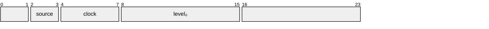
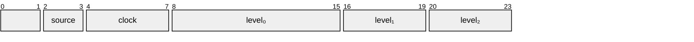
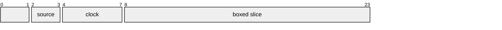

Edit-independent text positions

# Edit-independence

Understanding these details is not needed to use text storage.

There three variations of text position.

## Small

Small text positions can only hold a single level identifier. They are [most often][offset] used to refer to positions in the (original, unmodified)
contents of a text file.

[offset]: Position::from_offset

These positions are typically not actually generated for the elements within the file, but are synthesized as needed to refer to any locations within it. Note that
small positions do not necessarily have any performance benefits over using a [medium] position identifier. They primarily exist as a distinct type to represent these implicit
positions.

## Medium

Medium text positions store up to three levels in an inline `array`.

The various position allocation strategies are designed to minimize the average lengths of positional identifiers; even under heavy editing. As a result, most of the identifiers seen should be [medium] in size.

In the occasions that editing produces an identifier that cannot fit within three levels, a [large] position will be generated.

## Large

Large positions are limited only by available memory but in practice should be much smaller, and relatively rare.

Unlike the other position variants, level₀ is not stored inline in the `Position`, but is stored along with the rest of the identifier in the `boxed`
slice.

### Note

The [source] and [clock] fields exist primarily to support asynchronous/collaborative editing. However, since the [large] position variant forces the `Position` enum
to have 8-byte alignment, there is no overhead to storing them unconditionally in every `Position`.

[small]: #small
[medium]: #medium
[large]: #large
[source]: Position::source
[clock]: Position::clock

